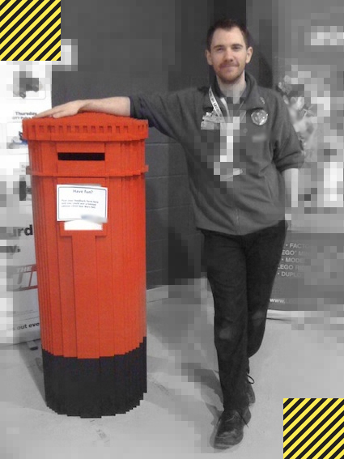

A tribute to resilience in the face of adversity - and a homage to the solitary pillar box left in tact by the 1996 bomb blast.  

This faithful 1:1 recreation, in 2x4 red LEGO bricks, serves also as salute to the unstinting efforts of Postmen and Postwomen everywhere.    

