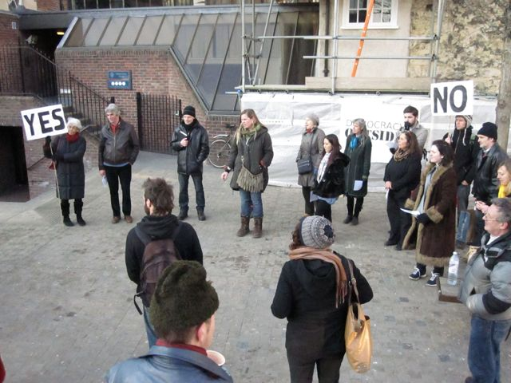
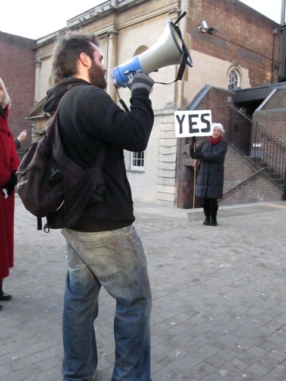

**2-2.45pm St Ann's Square**   

A group of protesters, placards and banners in hand, cluster together in typical formation… Seemingly without cause, they beg the question "what are you protesting?" Blurring the boundaries of art and activism they invite you to break out of your apathy and join them in a new demonstration of democracy.   

Artist and activist Clare Cochrane works in and with communities to explore and activate community relationships in the face of demographic and economic change.  Her work in the historic Jericho area of Oxford can be seen [here](http://openingtheheartofjericho.wordpress.com). Other recent work includes *Honest & True*, an audio installation for OVADA at Oxford Town Hall in December 2011.   

