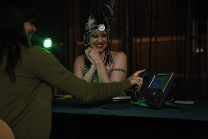

Signs, Symbols and astrology for some are like a set of co-ordinates to an unknown destination. Experience an eccentric take on your traditional visit to the fortune teller in a big red bus, and receive a message from the sky. The phone is ringing for you....... will you make it to the phone booth on time?    

Over the past twelve years Annette Foster has created multimedia solo performance art and video pieces. The content of her work has grown from an autobiographical view of psychological and emotional life to a more curious mix of feminism, identity, gender, difference and sexuality. Annette has exhibited her work regionally, nationally and internationally including; Arizona, Washington, Chicago, Colorado, Nottingham, Leicester, Hull, Derby, Bristol, Manchester, Glasgow and Dieppe, France.    

