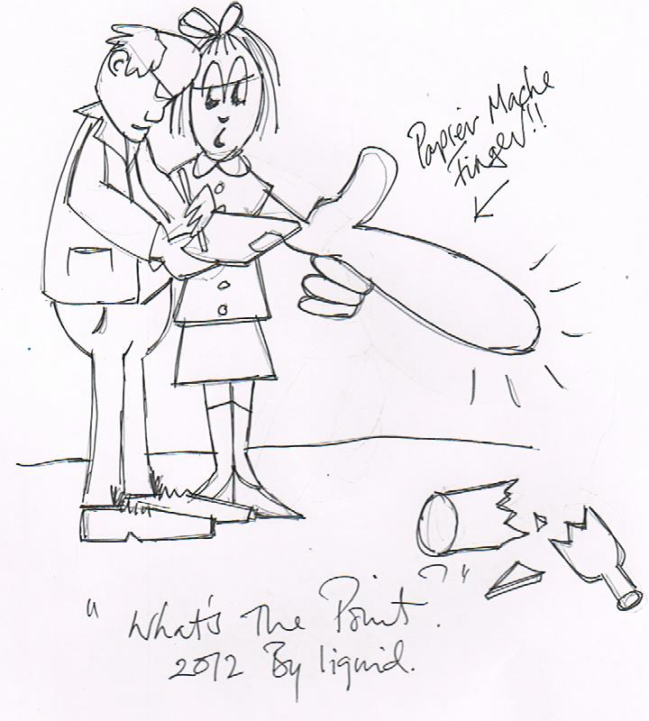
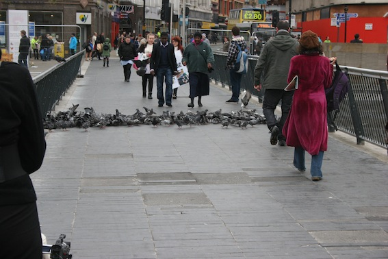

The world around is fraught with danger, hazard and risk.  Liquid offer us a helping hand in avoiding the calamities that a city centre stroll might invoke.   

Liquid is a collaboration between Simon Kennedy and Beth Barlow, originating from a fine art background, they describe their collective work as conceptual, painterly and engaged.    

