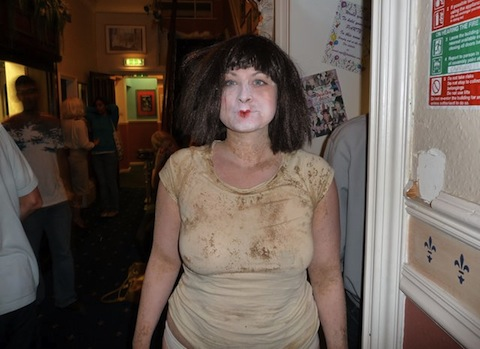
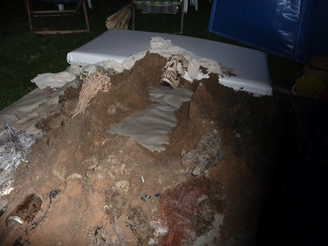

A durational live art still life, using re-located sand from Skegness and recycled super-8 footage from the artist’s family archives; as a ‘man-made’ beach, the body becomes a site to explore memories and nostalgia, and ethics of transformation, ritual and regeneration.       

Rachel Parry’s artwork is concerned with belonging and rejection, exploring the ever-changing relationship between artist and audience. She is interested in the boundaries of how an intimate relationship can quickly be formed with complete strangers. She asks how can she make an audience member feel a sense of love, security or empathy and where does this place “Us” as Artists?      

[For more information about Rachel Parry](http://contemporaryperformance.org/profile/RachelParry)     


