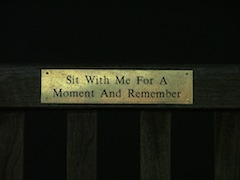

Thank you for joining me on this bench today.     

A bench with a plaque reading ‘Sit with me for a moment and remember’ is placed in St Ann’s Square.    

You are invited to sit on the bench for five minutes to listen to a recording that reflects on what it means to sit for a moment and remember.   

Michael Pinchbeck is a writer, live artist and theatre maker from Nottingham. Describing his work as an exit strategy from the everyday, Pinchbeck uses autobiography as a means to illustrate loss, explore absence and presence and aims to challenge the boundaries of text, performance and installation by reliving memories and revisiting real-life events.    

[For more information about Michael Pinchbeck](www.michaelpinchbeck.co.uk)


