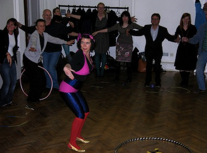
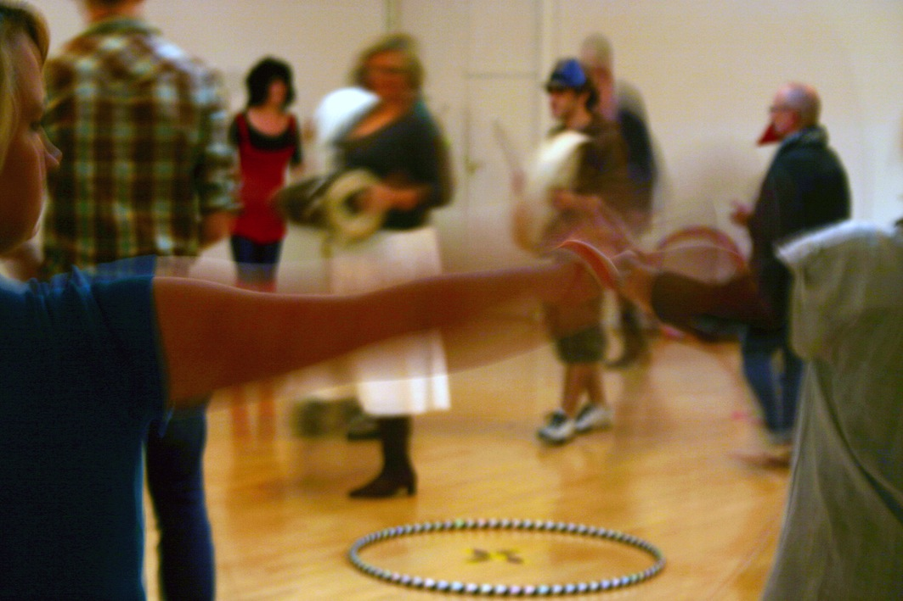

A nostalgic look at those lost childhood and childish moments of playful learning, exercising and gaming.    

Throwing caution to the wind, all are urged to take up the hoop and join in the games.    
   

Katherina has been making solo performance work since 2005. Her most recent work *Fallen Fruit - now here, now gone*, was seen in Manchester this June and will tour nationally in Spring 2013. Two Destination Language, a collaboration with Alister Lownie, is a resident company at Salisbury Arts Centre.

A Rules&Regs - South Hill Park commission 2009.

