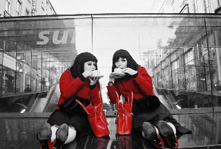

SHRUG Ladies will enjoy their summer holiday, whilst ensuring they minimise all risks, and deal with all dangers efficiently to allow for the most relaxing holiday of all. Think of the SHRUG Ladies as your personal safety wardens.     

*If a wasp threatens your picnic, we will be there; if you forget your sun cream, if the rain falls, we will be there!*    

SHRUG ‘happenings’ began with an urge for glamour, a chance to turn monotonous actions into durational acts: performances for everyone to view. The audience is the general public, anyone and everyone who wants to interact is encouraged to do so, or walk by, or stare from afar.     
[For more information about SHRUG](http://www.shrugladies.com)    

