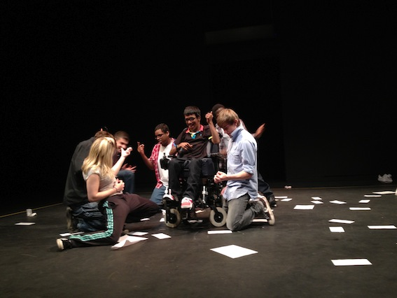

*How often do you talk to teenagers that you don't know? How do you think you may see the world differently if you did?*     

 A one-on-one performance that creates a safe space where you can walk and talk with a teenager you've never met before..and ask the questions that you've always wanted to ask, whilst also putting your heads together to solve the problems of the world. Rediscover the honesty of youth and challenge yourself to be optimistic enough to see the world through teenage eyes.    
 
Small Things use creativity, performance and participation to make creative adventures for the uncertain world we live in. We make inventive and beautifully crafted performances, playful adventures and creative experiences, with professional and non-professional performers and artists that take inspiration from the investigation and telling of stories that reflect the world around us.    
  
