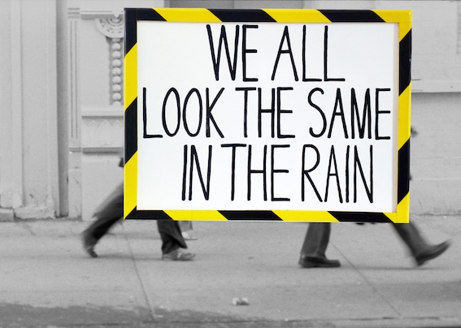

*What are you selling me?*    

The City Centre submerges us in a sea of visual culture: enticing, cajoling, inveigling us to buy something. So what's the point of a billboard that isn't on a mission to sell?   

   

Nicola Smith works across a range of mediums - live art, intervention, installation and video to make work in response to the context of her surroundings.  Acting as 'host' to a series of performed actions, she punctuates the public and private space to engage an incidental audience.    

