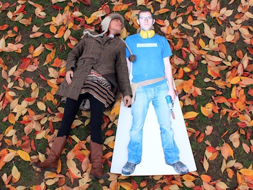

Zoo Indigo create various hazardous still images and moving happenings with their life-size, flat-pack children, in a journey around St Ann’s Square. The performance duo will frantically create the chaos and joy of daily family hysteria as they work around their flat-pack children. Watchers will be given parental responsibilities to ensure the family is having a 'good time'. 

Zoo Indigo is a Nottingham based performance company creating experimental performance work and site responsive experiments that work with the family in performance and the ‘non’ performer.

[For more information about Zoo Indigo](http://www.zooindigo.co.uk) 

